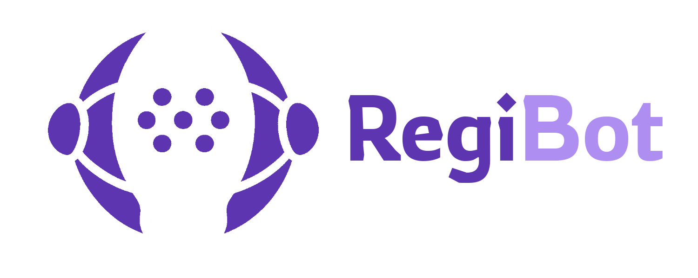
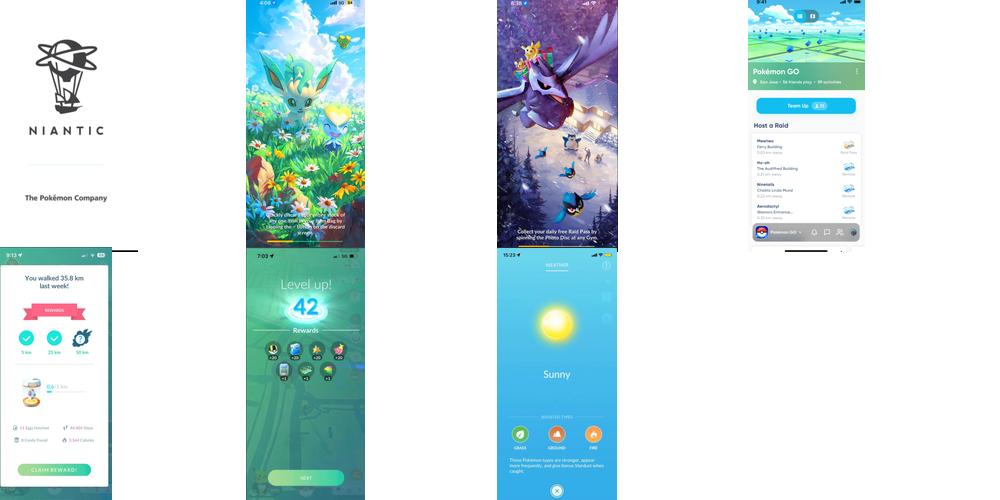

## Introduction
RegiBot is a tool designed to simulate basic actions in Pokemon GO using computer vision and Accessibility permissions.

- [Demo video](https://youtu.be/vDXfKY8P7DU)

- [Download APK](https://github.com/Juancavr6/RegiBot/releases)

---

## Requirements

- **Minimum Android version**: <ins>11.0</ins>  (API 30)  
- **Architecture**: arm64-v8a / x86  
- **Requested permissions**:  
  - Accessibility  
  - Display over other apps  

> ⚠️ **Note:** The app is not compatible with emulators using *x86_64* architecture.

---

## Installation Recommendations

Before installing, make sure to enable the *"Install from unknown sources"* option on your Android device.

- **Enable Accessibility**: 
Accessibility permissions are strictly required, as they are what allow the app to perform actions on the screen.  
If the Accessibility toggle is blocked, you’ll need to **enable restricted settings** first.

- **Enable Restricted Settings**:  
  This option is usually required in order to activate Accessibility for the app. While it may vary depending on the device, it can generally be enabled like this:

    -   Settings > Apps > RegiBot > ︙ > Allow restricted settings
    
> ⚠️ On Android 15, this option may not be accessible on certain devices.
 This [Reddit post](https://www.reddit.com/r/accessibility/comments/1idl3gb/how_to_enable_accessibility_permission_for/) provides some insight on the issue.

---

## Usage 

If the necessary permissions are granted (you can check this from the app under **More > Permissions**), you're ready to start the bot.

- When you tap **START**, wait for the play button (▶) to appear in the floating menu.  
❗Before pressing it:  
 **Make sure you're not on a loading screen or outside of Pokemon GO, or the bot may start performing actions on your screen!**
 Ideally, wait until you're on the **map screen**.

- Keep in mind that the app may get stuck on screens that are not typically part of the capture/spin PokeStops flow.  
**Examples of screens the app is (probably) not able to handle properly:**

## Parameters
**There's no need to change any setting by default**, but in certain situations, some adjustments may be useful:

- **Priority Order**:  
  You can enable/disable Pokemon catching or PokeStop spinning, or reorder them to set priority.  
  *RocketStops are handled separately, as the model tends to confuse them frequently.*

- **Fast Catch**:  
  Uses the classic fast-catch technique to speed up encounters.  
  If you're experiencing issues or prefer to ensure successful catches, you can disable this — the bot should still be able to catch normally.

- **Throw Power Boost**:  
  Applies a percentage-based correction to the calculated throw strength.  
  Since the distance to Pokemon is inferred only from 2D visual data, throw generalization can be tricky.  
  For distant Pokemon, applying a boost is often the easiest way to ensure successful throws.

- **Preset Pokeball Position**:  
  By default, the bot taps the Pokeball using screen-relative coordinates during encounters (since its position is usually fixed).  
  However, if this does not align correctly, you can disable this option to allow dynamic detection of the Pokeball.  
  *You can also enable the option to save the detected position once it's found, which improves speed in future encounters.*

The **Parameters** section is primarily intended for testing and experimental configurations:

- **Cycle Interval**:  
  Defines the pause after each action to control the speed of iteration. A higher value slows down the bot's execution pace.

- **Results per Inference**:  
  Sets the maximum number of results evaluated per detection cycle.  
  Increasing this can help in scenarios where you want to ignore the most common object — for example, when there are many Pokemon on-screen but you're only targeting PokeStops.

- **Throw Power Boost (%)**:  
  Specifies the percentage by which the calculated throw power is increased when *Throw Power Boost* is enabled. 
  ❗Be careful not to raise this value too much! While it can be fun to see the PokeBall shoot off dramatically, excessively high values may result in on-screen actions that are too fast to execute properly.

- **Thresholds**:  
  Minimum confidence levels required for a detection to be considered valid.  
  Tweaking these can help if the bot gets stuck on certain tasks or struggles with detection accuracy.

---
Just if you'd like to support  

---
